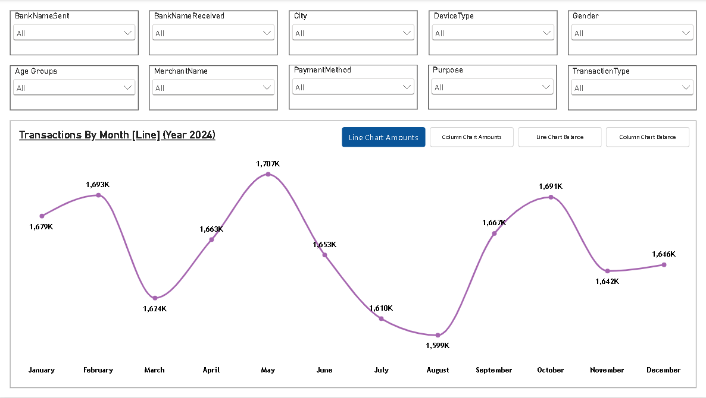
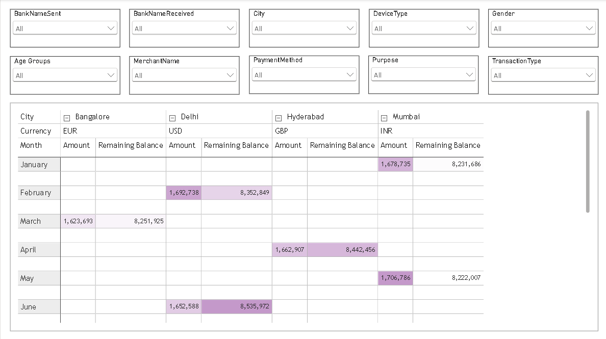

# UPI Transactions Data Analysis – Power BI

An interactive Power BI dashboard for analyzing UPI transaction data across transaction trends, amounts, balances, banks, cities, devices, demographics, merchants, payment methods, purposes, and transaction types.

## Project Overview

This project analyzes a dataset of **20,000 UPI transactions** recorded during 2024. The data contains transaction-level information including transaction amounts, remaining balances, banks, cities, customer demographics, devices, payment methods, merchants, transaction purposes, transaction types, currencies, and account information.

The project uses **Microsoft Power BI** to transform the raw transaction data into an interactive analytical dashboard. Users can filter the data across multiple dimensions and explore transaction trends and financial metrics dynamically.

The dashboard focuses on:

- Monthly transaction trends
- Transaction amounts
- Remaining balances
- Bank-wise analysis
- City-wise analysis
- Device-wise analysis
- Demographic analysis
- Merchant analysis
- Payment method analysis
- Purpose analysis
- Transaction type analysis

---

## Dataset

The dataset contains **20,000 transaction records and 20 columns**.

### Dataset Columns

| Column | Description |
|---|---|
| `TransactionID` | Unique identifier for each transaction |
| `TransactionDate` | Date on which the transaction occurred |
| `Amount` | Transaction amount |
| `BankNameSent` | Bank from which the transaction was initiated |
| `BankNameReceived` | Bank receiving the transaction |
| `RemainingBalance` | Remaining account balance after the transaction |
| `City` | City associated with the transaction |
| `Gender` | Customer gender |
| `TransactionType` | Type of transaction |
| `Status` | Transaction status |
| `TransactionTime` | Time at which the transaction occurred |
| `DeviceType` | Device used for the transaction |
| `PaymentMethod` | Method used to make the payment |
| `MerchantName` | Merchant associated with the transaction |
| `Purpose` | Purpose of the transaction |
| `CustomerAge` | Customer age |
| `PaymentMode` | Mode of payment |
| `Currency` | Currency associated with the transaction |
| `CustomerAccountNumber` | Customer account identifier |
| `MerchantAccountNumber` | Merchant account identifier |

---

## Tools & Technologies

- **Microsoft Power BI**
- **DAX**
- **Data Visualization**
- **Slicers**
- **Bookmarks**
- **Selection Pane**
- **Microsoft Excel**

---

## Dashboard Features

### 1. Interactive Filters

The dashboard provides interactive slicers that allow users to filter the analysis by:

- Sending Bank
- Receiving Bank
- City
- Device Type
- Gender
- Age Group
- Merchant
- Payment Method
- Purpose
- Transaction Type

These filters allow users to explore specific segments of the transaction dataset.

---

### 2. Monthly Transaction Analysis

The dashboard provides a monthly view of transaction activity throughout **2024**.

Users can switch between different visualizations to analyze:

- Transaction amounts by month
- Remaining balance by month
- Monthly transaction trends

The dashboard uses interactive chart controls to switch between line and column visualizations.

---

### 3. Transaction Amount Analysis

Transaction amounts can be analyzed across different dimensions such as:

- Month
- City
- Bank
- Merchant
- Payment method
- Transaction type
- Purpose

This helps identify patterns in transaction activity across different segments.

---

### 4. Remaining Balance Analysis

The dashboard also analyzes remaining account balances alongside transaction amounts.

This allows users to compare:

- Transaction amounts
- Remaining balances
- Monthly changes
- City-level financial activity

---

### 5. Multi-Dimensional Analysis

The dashboard supports analysis across **8 major dimensions**:

1. Banks
2. Cities
3. Devices
4. Demographics
5. Merchants
6. Payment Methods
7. Purposes
8. Transaction Types

This makes it possible to investigate transaction behavior from multiple perspectives.

---

### 6. Matrix-Based Analysis

A matrix visualization is used to compare transaction amounts and remaining balances across:

- Cities
- Months
- Currencies

The matrix allows users to drill into different city and month combinations and compare financial metrics.

---

## Power BI Features Used

### DAX

DAX is used to create analytical calculations and measures required for the dashboard.

### Slicers

Slicers provide interactive filtering across banks, cities, devices, demographics, merchants, payment methods, purposes, and transaction types.

### Bookmarks

Bookmarks are used to control different dashboard views and interactive visualization states.

### Selection Pane

The Selection Pane is used to control the visibility of dashboard elements and support interactive report views.

### Interactive Visualizations

The dashboard includes:

- Line charts
- Column charts
- Matrix reports
- Interactive filters
- Dynamic visualization controls

---

## Dashboard Preview

### Monthly Transaction Analysis



The first dashboard page provides interactive filters and a monthly transaction analysis for 2024.

Users can switch between different chart views for transaction amounts and remaining balances.

---

### City and Monthly Analysis



The second dashboard page provides a matrix-based analysis of transaction amounts and remaining balances across cities, currencies, and months.

---

## Key Analysis Areas

The dashboard enables users to investigate questions such as:

- How do transaction amounts change month by month?
- Which banks are associated with transaction activity?
- How does transaction activity vary across cities?
- How do different devices contribute to transaction activity?
- How does transaction behavior vary across demographic groups?
- Which merchants are associated with transaction activity?
- How are different payment methods used?
- How does transaction activity vary by purpose?
- How do different transaction types compare?
- How do transaction amounts and remaining balances vary across cities and months?

---

## Project Structure

```text
UPI-Transactions-Data-Analysis/
│
├── UPI_Transactions_Dashboard.pbix
├── UPI_Transactions_Data.xlsx
├── README.md
│
└── screenshots/
    ├── dashboard_page1.png
    └── dashboard_page2.png
